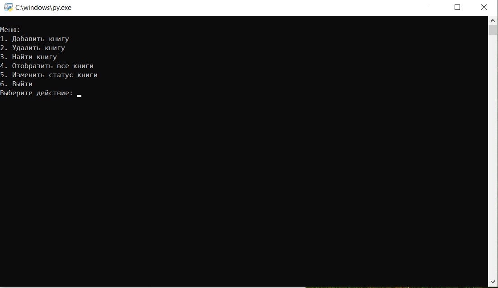
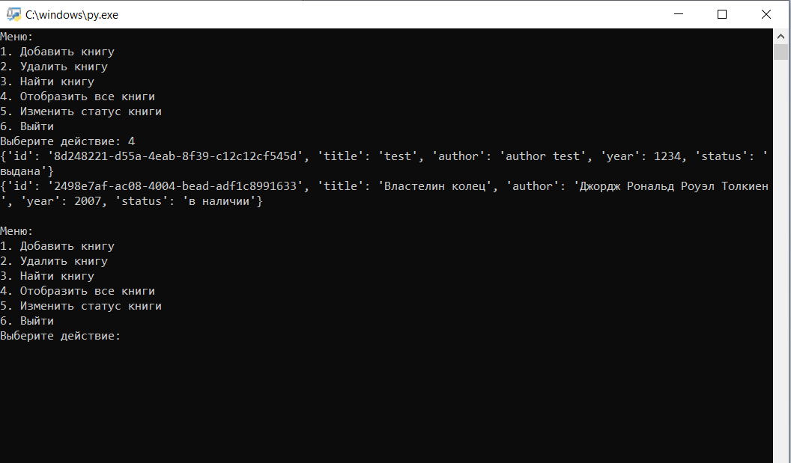

# Разработка системы управления библиотекой

## Описание

Этот проект представляет собой консольное приложение для управления библиотекой книг.
## Функциональность

- **Добавление книги**: Позволяет добавить новую книгу с указанием названия, автора и года издания.
- **Удаление книги**: Удаляет книгу из библиотеки по уникальному идентификатору (ID).
- **Поиск книги**: Ищет книги по заданному полю (title, author, year) и значению.
- **Отображение всех книг**: Показывает список всех книг в библиотеке.
- **Изменение статуса книги**: Обновляет статус книги (например, "в наличии" или "выдана").

## Установка

1. Склонируйте репозиторий:
   ```bash
   git clone https://github.com/daniilseliverstov/test_for_Effective-Mobile
   ```

2. Перейдите в директорию проекта:
   ```bash
   cd Test_for_Effective Mobile
   ```

3. Убедитесь, что у вас установлен Python 3.x. Если нет, скачайте и установите его с [официального сайта Python](https://www.python.org/downloads/).

4. Запустите скрипт:
   ```bash
   python library_manager.py
   ```

## Использование

После запуска программы вы увидите меню с доступными действиями:

1. Добавить книгу
2. Удалить книгу
3. Найти книгу
4. Отобразить все книги
5. Изменить статус книги
6. Выйти

Следуйте инструкциям на экране для выполнения нужных действий.

## Формат данных

Каждая книга представлена в виде словаря с следующими полями:

- `id`: Уникальный идентификатор книги.
- `title`: Название книги.
- `author`: Автор книги.
- `year`: Год издания книги.
- `status`: Статус книги (по умолчанию 'в наличии').




## Контакты

Если у вас есть вопросы или предложения, пожалуйста, свяжитесь со мной по электронной почте: selivrstov91@internet.ru

---

Надеюсь, этот проект будет вам полезен!